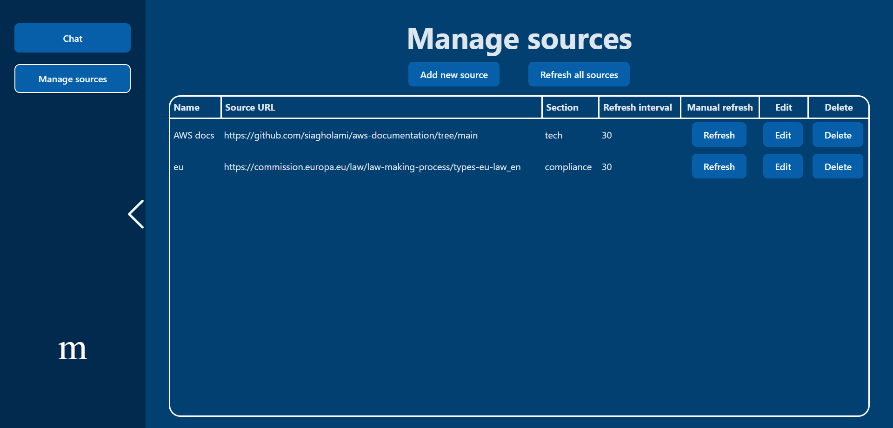

# Sweng 2024 Group 6 Project 
Intelligent Information Ecosystem (I2ECO): A Multi-Agent Crawler System with Access Controlled LLMs and Chat Support

## Building and running instructions
In order to run the app in production mode execute:
```
docker compose build
docker compose up
```

Note that when running the app with local LLM for the first time, it may take a long time to download the model.

File `openai.env` can be used to optionally specify the environment variable `OPENAI_API_KEY` containing the OpenAI API key. If it is provided, the app uses OpenAI API instead of a locally run model.

When running a local model, the relevant GPU configuration can be specified in `compose.yml`. Local LLM is run using the `ollama` container.

The app can also be run in the dev mode, in that case no calls to the LLM are made. Frontend server can be run with `npm run dev` command executed inside the frontend folder, backend API server can be run with `uvicorn backend_api:app` command executed inside the proper virtual environment set up in the backend folder.

## Preview


